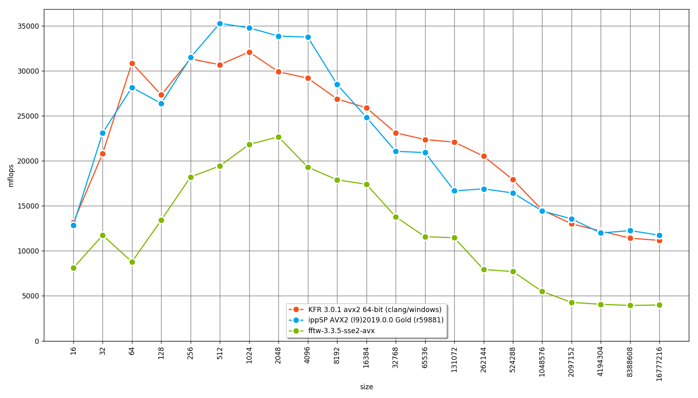
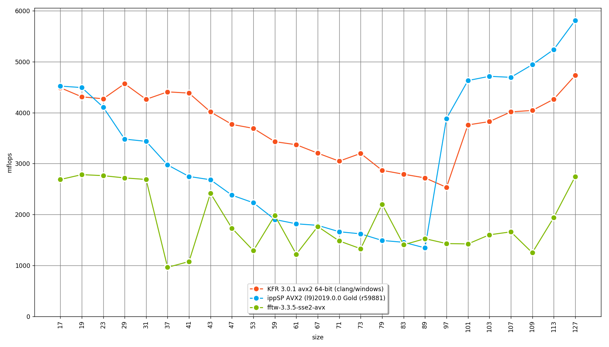
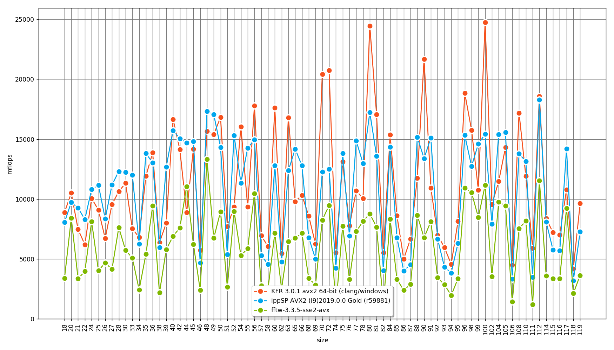
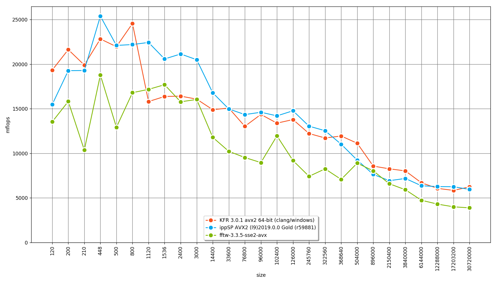
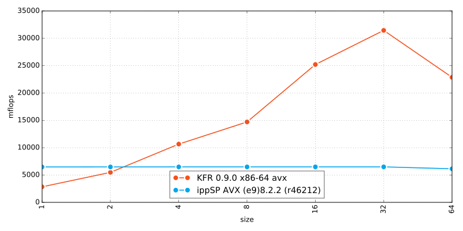

# KFR - Fast, modern C++ DSP framework


[](https://gitter.im/kfrlib/kfr) 

Compiler support:


https://www.kfr.dev

KFR is an open source C++ DSP framework that focuses on high performance (see benchmark results section).

KFR has no external dependencies except C++14-compatible standard C++ library.

# Features

## What's new in KFR 3.0

* Optimized non-power of two DFT implementation
* GCC 7+ support
* MSVC 2017 support
* Full AVX-512 support
* EBU R128
* Ability to include KFR as a subdirectory in cmake project
* Ability to link objects built for multiple architectures into one binary
* Number of automatic tests has been increased
* C API for DFT
* GPL version changed from 3 to 2+

## All features

* All code in the library is optimized for Intel, AMD (SSE2, SSE3, SSE4.x, AVX and AVX2 and AVX512) and ARM (NEON) processors
* Mathematical and statistical functions
* Template expressions (See examples)
* All data types are supported including complex numbers
* All vector lengths are also supported. `vec<float,1>`, `vec<unsigned,3>`, `vec<complex<float>, 11>` all are valid vector types in KFR
* Most of the standard library functions are re-implemented to support vector of any length and data type
* Runtime cpu detection

### Included DSP/audio algorithms:

* FFT
* Convolution
* FIR filtering
* FIR filter design using the window method
* Resampling with configurable quality (See resampling.cpp from Examples directory)
* Goertzel algorithm
* Fractional delay
* Biquad filtering
* Biquad design functions
* Oscillators: Sine, Square, Sawtooth, Triangle
* Window functions: Triangular, Bartlett, Cosine, Hann, Bartlett-Hann, Hamming, Bohman, Blackman, Blackman-Harris, Kaiser, Flattop, Gaussian, Lanczos, Rectangular
* Audio file reading/writing
* Pseudorandom number generator
* Sorting
* Ring (Circular) buffer
* Simple waveshaper
* Fast incremental sine/cosine generation
* EBU R128

# Benchmark results
## DFT

### KFR 3.0.1

Powers of 2, from 16 to 16777216 (*Higher is better*)



Prime numbers from 17 to 127 (*Higher is better*)



Small numbers from 18 to 119 (*Higher is better*)



Random sizes from 120 to 30720000 (*Higher is better*)



See [fft benchmark](https://github.com/kfrlib/fft-benchmark) for details about benchmarking process.


## Biquad

 (*Higher is better*)


    
# Usage

## Common prerequisites

* CMake 3.0 or newer for building tests and examples
* Python 2.7 or 3.x for running examples
* (Optional) Ninja (https://ninja-build.org/)

For running examples and plotting frequency responses of filters the following python packages are required:
  
```bash
pip install matplotlib
pip install numpy
pip install scipy
```
Or download prebuilt python packages for windows

To obtain the full code, including examples and tests, you can clone the git repository:

```
git clone https://github.com/kfrlib/kfr.git
```

## Including in CMake project

CMakeLists.txt contains two libraries:
* `kfr` - header only interface library
* `kfr_dft` - static library for DFT and related algorithms

```cmake
# Include KFR subdirectory
add_subdirectory(kfr)

# Add header-only KFR to your executable or library, this sets include directories etc
target_link_libraries(your_executable_or_library kfr)

# Add KFR DFT to your executable or library, (cpp file will be built for this)
target_link_libraries(your_executable_or_library kfr_dft)
```

## Makefile, command line etc

```bash
# Add this to command line
-Ipath_to_kfr/include
```

## Linux

### Prerequisites
* GCC 5.4 or newer
* Clang 4.0 or newer

### Command line
```bash
cd <path_to_kfr>
mkdir build && cd build
cmake -DENABLE_TESTS=ON -DCMAKE_CXX_COMPILER=clang++ -DCMAKE_BUILD_TYPE=Release ..
make -- -j
```
Or using Ninja
```bash
cd <path_to_kfr>
mkdir build && cd build
cmake -GNinja -DENABLE_TESTS=ON -DCMAKE_CXX_COMPILER=clang++ -DCMAKE_BUILD_TYPE=Release ..
ninja
```

## macOS

### Prerequisites
* XCode 8.3, 9.x or 10.x

### Command line
Using Xcode project:
```bash
cd <path_to_kfr>
mkdir build && cd build
cmake -GXcode -DENABLE_TESTS=ON -DCMAKE_BUILD_TYPE=Release ..
cmake --build .
```
Using Unix Makefiles:
```bash
cd <path_to_kfr>
mkdir build && cd build
cmake -G"Unix Makefiles" -DENABLE_TESTS=ON -DCMAKE_BUILD_TYPE=Release ..
make -- -j
```
Or using Ninja:
```bash
cd <path_to_kfr>
mkdir build && cd build
cmake -GNinja -DENABLE_TESTS=ON -DCMAKE_BUILD_TYPE=Release ..
ninja
```

## Visual Studio

### Prerequisites
* Visual Studio 2017
* Latest Clang (http://llvm.org/)
* Ninja is highly recommended because Visual Studio does not support parallel build with Clang at this moment.

### Visual Studio IDE

To work with KFR in Visual Studio you must add the path to the `include` directory inside KFR directory to the list of the project's include directories.<br>
More details:
https://docs.microsoft.com/en-us/cpp/ide/vcpp-directories-property-page?view=vs-2017

Make sure that LLVM toolset is set for the project<br>

Download and install official LLVM extension:
* LLVM toolchain for Visual Studio https://marketplace.visualstudio.com/items?itemName=LLVMExtensions.llvm-toolchain

More details:
https://docs.microsoft.com/en-us/cpp/ide/general-property-page-project?view=vs-2017

LLVM/Clang has very good compatibility with MSVC ABI and it's widely used for building large projects on Windows (including Chrome), so switching to LLVM/Clang should not cause compatibility problems.

### Command line
Using Ninja:
```
cd <path_to_kfr>
mkdir build && cd build
call "C:\<path to your Visual Studio installation>\VC\Auxiliary\Build\vcvars64.bat"
cmake -GNinja -DENABLE_TESTS=ON -DCMAKE_CXX_COMPILER="C:/Program Files/LLVM/bin/clang-cl.exe" -DCMAKE_CXX_FLAGS=-m64 -DCMAKE_BUILD_TYPE=Release ..
ninja
```
Or generate Visual Studio solution (building will be slower):
```
cd <path_to_kfr>
mkdir build && cd build
cmake -G"Visual Studio 15 2017 Win64" -DENABLE_TESTS=ON -Tllvm -DCMAKE_BUILD_TYPE=Release ..
```

## MinGW/MSYS

### Prerequisites
* Latest MinGW or MSYS2
* Clang 4.0 or newer

Using Makefiles:
```
cd <path_to_kfr>
mkdir build && cd build
cmake -DENABLE_TESTS=ON -DCMAKE_BUILD_TYPE=Release ..
make -- -j
```
Using Ninja:
```
cd <path_to_kfr>
mkdir build && cd build
cmake -GNinja -DENABLE_TESTS=ON -DCMAKE_BUILD_TYPE=Release ..
ninja
```

## Tests

Every commit is tested in various OS, compilers, compiler settings etc.

You can run the tests using these commands:

```bash
cd <path_to_cmake_build_directory>
cd tests
ctest -V
```

Tested on the following systems:

### macOS
* (**Intel AVX2**) macOS **10.13.6** / Xcode 10 / AppleClang 10.0.0.10001145
* (**Intel AVX** Azure Pipelines) macOS **10.13.6** / Xcode 10.1 / AppleClang 10.0.0.10001145
* (**Intel AVX** Azure Pipelines) macOS **10.13.6** / Xcode 10 / AppleClang 10.0.0.10001145
* (**Intel AVX** Azure Pipelines) macOS **10.13.6** / Xcode 9.4.1 / AppleClang 9.1.0.9020039
* (**Intel AVX** Azure Pipelines) macOS **10.13.6** / Xcode 9.0.1 / AppleClang 9.0.0.9000038
* (**Intel AVX** Azure Pipelines) macOS **10.13.6** / Xcode 8.3.3 / AppleClang 8.1.0.8020042
* (**Intel AVX2**) macOS **10.11.6** / Xcode 7.3 / AppleClang 7.3.0.7030031
* (**Intel AVX2**) macOS **10.11.4** / Xcode 7.3 / AppleClang 7.3.0.7030031
* (**ARMv7, ARMv7s, ARM64**) macOS **10.11.6** / Xcode 7.3 / AppleClang 7.3.0.7030031
* (**Intel AVX**) macOS **10.10.5** / Xcode 7.1 / AppleClang 7.0.0.7000176
* (**SSE4.2** Travis-CI) macOS **10.11.6** / Xcode 8 (beta4)  / AppleClang 8.0.0.8000035
* (**SSE4.2** Travis-CI) macOS **10.11.5** / Xcode 7.3 / AppleClang 7.3.0.7030031
* (**SSE4.2** Travis-CI) macOS **10.11.5** / Xcode 7.2 / AppleClang 7.0.2.7000181
* (**SSE4.2** Travis-CI) macOS **10.10.5** / Xcode 7.1 / AppleClang 7.0.0.7000176
* (**SSE4.2** Travis-CI) macOS **10.10.5** / Xcode 7 / AppleClang 7.0.0.7000072
* (**SSE4.2** Travis-CI) macOS **10.10.5** / Xcode 6.4 / AppleClang 6.1.0.6020053
* (**SSE4.2** Travis-CI) macOS **10.10.3** / Xcode 6.3 / AppleClang 6.1.0.6020049

### Ubuntu
* (**Intel AVX2**) Ubuntu **18.04** / gcc-7.x / clang version 7.0.0 (tags/RELEASE_700/final)
* (**Intel AVX2**) Ubuntu **16.04** / gcc-5.4.0 / clang version 3.8.0 (tags/RELEASE_380/final)
* (**ARMv7 NEON**) Ubuntu **16.04** / gcc-5.4.0 / clang version 3.8.0 (tags/RELEASE_380/final)
* (**ARMv7 NEON**) Ubuntu **14.04** / gcc-4.8.4 / clang version 3.8.0 (tags/RELEASE_380/final)
* (**ARMv7 NEON** Travis-CI) Ubuntu **14.04** / gcc-4.8.4 / clang version 3.8.0 (tags/RELEASE_380/final)
* (**Intel AVX2** Travis-CI) Ubuntu **12.04** / gcc-5.4.0 / clang version 3.8.0 (tags/RELEASE_380/final)
* (**Intel AVX2** Travis-CI) Ubuntu **14.04** / gcc-5.3.0 (Ubuntu 5.3.0-3ubuntu1~14.04) 5.3.0 20151204 / clang version 3.8.0 (tags/RELEASE_380/final)

### Windows
* (**Intel AVX512**) Windows **10** / Visual Studio 2017 / Clang 7.0
* (**Intel AVX512**) Windows **10** / Visual Studio 2017 / Clang 6.0
* (**Intel AVX2**) Windows **10** / MinGW-W64 5.2 / clang version 3.8.0 (branches/release_38)
* (**Intel AVX2**) Windows **10** / MinGW-W64 4.8 / clang version 3.8.0 (branches/release_38)
* (**Intel AVX**) Windows **8.1** / MinGW-W64 5.4 / clang version 3.8.0 (branches/release_38)
* (**Intel AVX**) Windows **8.1** / Visual Studio 2015 Update 2 / clang version 3.9.0 (SVN r273898 (27 June 2016))

### Linux on Windows 10
* (**Intel AVX2**) Windows **10.0.17134.407** compatible with Ubuntu **18.04** / gcc-7.x / clang version 7.0.0 (tags/RELEASE_700/final)
* (**Intel AVX2**) Windows **10.0.14393** compatible with Ubuntu **14.04** / gcc-5.4.0 / clang version 3.8.0 (tags/RELEASE_380/final)

## Planned for future versions

* Parallel execution of algorithms
* Serialization/Deserialization of any expression
* More formats for audio file reading/writing
* Reduce STL dependency

## License

KFR is dual-licensed, available under both commercial and open-source GPL 2+ license.

If you want to use KFR in commercial product or a closed-source project, you need to [purchase a Commercial License](https://kfr.dev/purchase-license)
