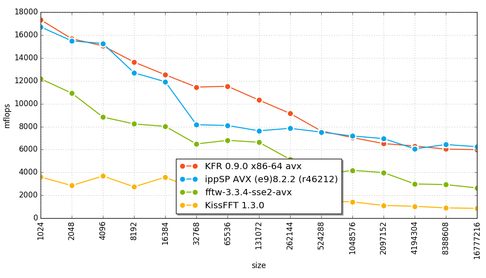

# KFR - Fast, modern C++ DSP framework

[](https://travis-ci.org/kfrlib/kfr) [](https://gitter.im/kfrlib/kfr)

https://www.kfrlib.com

What's new in release 1.0 - https://www.kfrlib.com/whatsnew

KFR is an open source C++ DSP framework that focuses on high performance (see benchmark results section).

KFR is a header-only and has no external dependencies.

## Features

* All code in the library is optimized for Intel, AMD (SSE2, SSE3, SSE4.x, AVX and AVX2) and ARM (NEON) processors
* Mathematical and statistical functions
* Template expressions (See examples)
* All data types are supported including complex numbers
* All vector lengths are also supported. `vec<float,1>`, `vec<unsigned,3>`, `vec<complex<float>, 11>` all are valid vector types in KFR
* Most of the standard library functions are re-implemented to support vector of any length and data type
* Runtime cpu detection

Included DSP/audio algorithms:

* FFT
* Convolution
* FIR filtering
* FIR filter design using the window method
* Resampling with configurable quality (See resampling.cpp from Examples directory)
* Goertzel algorithm
* Fractional delay
* Biquad filtering
* Biquad design functions
* Oscillators: Sine, Square, Sawtooth, Triangle
* Window functions: Triangular, Bartlett, Cosine, Hann, Bartlett-Hann, Hamming, Bohman, Blackman, Blackman-Harris, Kaiser, Flattop, Gaussian, Lanczos, Rectangular
* Audio file reading/writing
* Pseudorandom number generator
* Sorting
* Ring (Circular) buffer
* Waveshaper
* Fast incremental sine/cosine generation

## Benchmark results
### FFT

FFT (double precision, sizes from 1024 to 16777216)
See [fft benchmark](https://github.com/kfrlib/fft-benchmark) for details about benchmarking process.



### Biquad

[Biquad performance](https://github.com/kfrlib/biquad-benchmark/blob/master/bq.svg)
    
## Prerequisites

* macOS: XCode 6.3, 6.4, 7.x, 8.x
* Windows
  * MinGW 5.2 and Clang 3.7 or newer (MinGW 4.8 is also supported, but MinGW 5.x is recommended)
  * Visual Studio 2015 update 2 and latest Clang 3.9.0
* Ubuntu: GCC 5.1 and Clang 3.7 or newer
* CoMeta metaprogramming library (already included)

KFR is a header-only so just `#include <kfr/math.hpp>` to start using it

The following tools are required to build the examples:

* CMake 2.8 or newer

To build the tests:

* Testo - C++14 testing micro framework (included)
* Python 2.7 with the following modules:

  * dspplot (included, see Installation)
  * matplotlib
  * numpy
  * scipy

## Installation

To obtain the full code, including examples and tests, you can clone the git repository:

```
git clone https://github.com/kfrlib/kfr.git
```

To be able to run the tests and examples install the following python modules:

```
pip install matplotlib # or download prebuilt package for windows
pip install numpy # or download prebuilt package for windows
pip install scipy # or download prebuilt package for windows
```
Install dspplot using `python setup.py install` inside dspplot directory

## Tests

Execute `build.py` or `build-cl.py` (Visual Studio version) to run the tests or run tests manually from the `tests` directory

Tested on the following systems:

### macOS
* (**Intel AVX2**) macOS **10.11.6** / Xcode 7.3 / AppleClang 7.3.0.7030031
* (**Intel AVX2**) macOS **10.11.4** / Xcode 7.3 / AppleClang 7.3.0.7030031
* (**ARMv7, ARMv7s, ARM64**) macOS **10.11.6** / Xcode 7.3 / AppleClang 7.3.0.7030031
* (**Intel AVX**) macOS **10.10.5** / Xcode 7.1 / AppleClang 7.0.0.7000176
* (**SSE4.2** Travis-CI) macOS **10.11.6** / Xcode 8 (beta4)  / AppleClang 8.0.0.8000035
* (**SSE4.2** Travis-CI) macOS **10.11.5** / Xcode 7.3 / AppleClang 7.3.0.7030031
* (**SSE4.2** Travis-CI) macOS **10.11.5** / Xcode 7.2 / AppleClang 7.0.2.7000181
* (**SSE4.2** Travis-CI) macOS **10.10.5** / Xcode 7.1 / AppleClang 7.0.0.7000176
* (**SSE4.2** Travis-CI) macOS **10.10.5** / Xcode 7 / AppleClang 7.0.0.7000072
* (**SSE4.2** Travis-CI) macOS **10.10.5** / Xcode 6.4 / AppleClang 6.1.0.6020053
* (**SSE4.2** Travis-CI) macOS **10.10.3** / Xcode 6.3 / AppleClang 6.1.0.6020049

### Ubuntu
* (**Intel AVX2**) Ubuntu **16.04** / gcc-5.4.0 / clang version 3.8.0 (tags/RELEASE_380/final)
* (**ARMv7 NEON**) Ubuntu **16.04** / gcc-5.4.0 / clang version 3.8.0 (tags/RELEASE_380/final)
* (**ARMv7 NEON**) Ubuntu **14.04** / gcc-4.8.4 / clang version 3.8.0 (tags/RELEASE_380/final)
* (**ARMv7 NEON** Travis-CI) Ubuntu **14.04** / gcc-4.8.4 / clang version 3.8.0 (tags/RELEASE_380/final)
* (**Intel AVX2** Travis-CI) Ubuntu **12.04** / gcc-5.4.0 / clang version 3.8.0 (tags/RELEASE_380/final)
* (**Intel AVX2** Travis-CI) Ubuntu **14.04** / gcc-5.3.0 (Ubuntu 5.3.0-3ubuntu1~14.04) 5.3.0 20151204 / clang version 3.8.0 (tags/RELEASE_380/final)

### Windows
* (**Intel AVX2**) Windows **10** / MinGW-W64 5.2 / clang version 3.8.0 (branches/release_38)
* (**Intel AVX2**) Windows **10** / MinGW-W64 4.8 / clang version 3.8.0 (branches/release_38)
* (**Intel AVX**) Windows **8.1** / MinGW-W64 5.4 / clang version 3.8.0 (branches/release_38)
* (**Intel AVX**) Windows **8.1** / Visual Studio Update 2 / clang version 3.9.0 (SVN r273898 (27 June 2016))

### Linux on Windows 10
* (**Intel AVX2**) Windows **10.0.14393** compatible with Ubuntu **14.04** / gcc-5.4.0 / clang version 3.8.0 (tags/RELEASE_380/final)

## Planned for future versions

* DFT for any lengths (not only powers of two)
* Parallel execution of algorithms
* Serialization/Deserialization of any expression
* More formats for audio file reading/writing
* Reduce STL dependency

## License

KFR is dual-licensed, available under both commercial and open-source GPL license.

If you want to use KFR in commercial product or a closed-source project, you need to [purchase a Commercial License](https://kfrlib.com/purchase-license)
