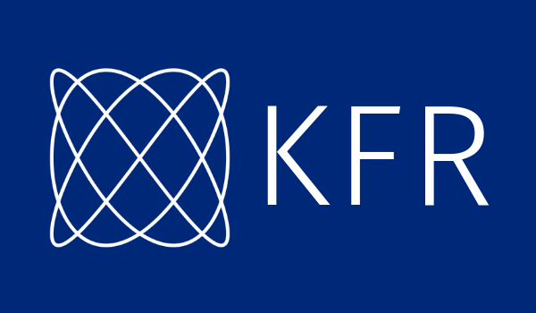

# KFR - Fast, modern C++ DSP framework

  

https://www.kfr.dev

KFR is an open source C++ DSP framework that contains high performance building blocks for DSP, audio, scientific and other applications. It is distributed under dual GPLv2/v3 and [commercial license](https://kfr.dev/purchase).

## [Installation](docs/docs/installation.md)

Compiler support:

KFR has no external dependencies except a C++17 compatible standard C++ library.
CMake is used as build system.

Clang is highly recommended and proven to provide the best performance for KFR. You can use clang as a drop-in replacement of both GCC on Linux and MSVC on Windows. On macOS clang is the default compiler and included in the official Xcode toolchain.

_Note_: Building DFT module requires Clang at this moment due to internal compiler errors and lack of optimization in GCC and MSVC.

:arrow_right: See [Installation](docs/docs/installation.md)   for more details

## Features

### FFT/DFT
* Optimized DFT implementation for any size (non-power of two sizes are supported)
* DFT performance is on par with the most performant implementation currently available [See Benchmarks](#benchmark-results)
* Real Forward and Inverse DFT
* Discrete Cosine Transform type II (and its inverse, also called DCT type III)
* Convolution using FFT
* Convolution filter

:arrow_right: See also [How to apply FFT](docs/docs/dft.md) with KFR

### DSP

* IIR filter design
  * Butterworth
  * Chebyshev type I and II
  * Bessel
  * Lowpass, highpass, bandpass and bandstop filters
  * Conversion of arbitrary filter from {Z, P, K} to SOS format (suitable for biquad function and filter)
* Biquad filter [See Benchmarks](#benchmark-results)
* Simple biquad filter design
* FIR filter design using window method
* Loudness measurement according to EBU R128
* Window functions: Triangular, Bartlett, Cosine, Hann, Bartlett-Hann, Hamming, Bohman, Blackman, Blackman-Harris, Kaiser, Flattop, Gaussian, Lanczos, Rectangular
* Sample rate conversion with configurable quality and linear phase
* Oscillators, fast incremental sine/cosine generation,  Goertzel algorithm, fractional delay

### Base

* Tensors (multidimensional arrays)
* Statistical functions
* Random number generation
* Template expressions (See examples)
* Ring (Circular) buffer

### Math

* Mathematical functions such as `sin`, `log` and `cosh` built on top of SIMD primitives
* Most of the standard library functions are re-implemented to support vector of any length and data type

### SIMD

* `vec<T, N>` class and related functions that abstracts cpu-specific intrinsics
* All code in the library is optimized for Intel, AMD (SSE2, SSE3, SSE4.x, AVX and AVX2 and AVX512) and ARM, AArch64 (NEON) processors
* All data types are supported including complex numbers
* All vector lengths are also supported. `vec<float,1>`, `vec<unsigned,3>`, `vec<complex<float>, 11>` all are valid vector types in KFR
* Sorting

### IO

* Audio file reading/writing
* WAV
* FLAC
* MP3

### C API

C API is available and includes a subset of KFR features including FFT and filter processing.

## Benchmark results

### DFT

Powers of 2, from 16 to 16777216 (*Higher is better*)

Prime numbers from 17 to 127 (*Higher is better*)

Small numbers from 18 to 119 (*Higher is better*)

Random sizes from 120 to 30720000 (*Higher is better*)

See [fft benchmark](https://github.com/kfrlib/fft-benchmark) for details about benchmarking process.

### Biquad

(*Higher is better*)

## Documentation

Documentation home:

KFR 5 (latest)
https://www.kfrlib.com/docs/latest/

KFR 4
https://www.kfrlib.com/docs/v4/

Built with
* [cxxdox - generates markdown docs from C++](https://github.com/kfrlib/cxxdox)
* [mkdocs - static documentation generator](https://www.mkdocs.org/)
* [mkdocs-material - material theme for mkdocs](https://squidfunk.github.io/mkdocs-material/)

## Branches

`dev` - current development version. Pull requests should go to `dev`.

`master` - current stable version passing all compiler/architecture tests.

`v4` - previous version of KFR (no new features here, fixes only)

## License

KFR is dual-licensed, available under both commercial and open-source GPL 2+ license.

If you want to use KFR in a commercial product or a closed-source project, you need to [purchase a Commercial License](https://kfr.dev/purchase-license)
