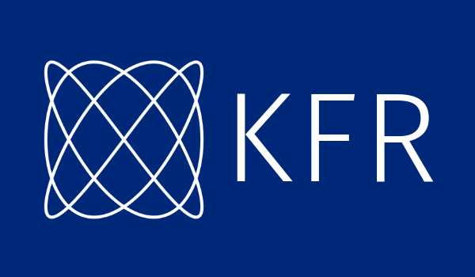
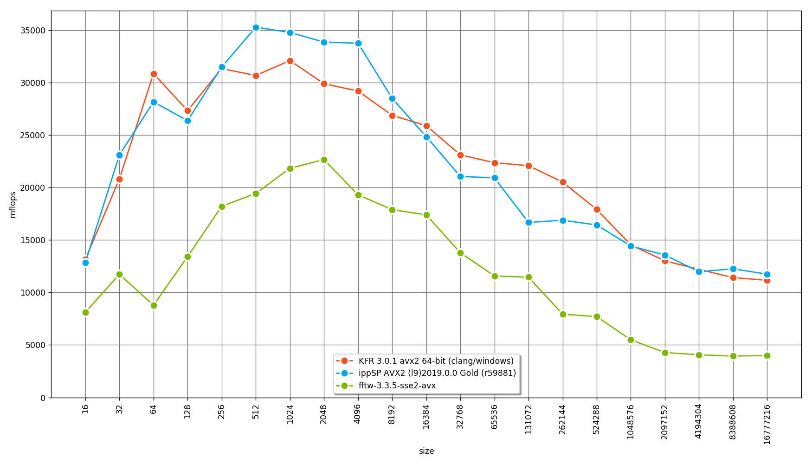
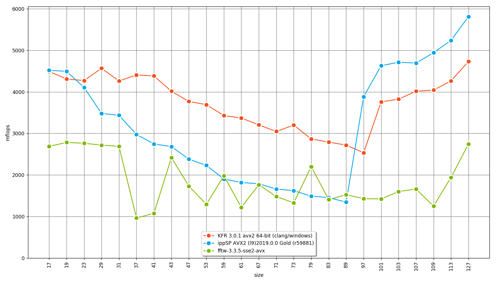
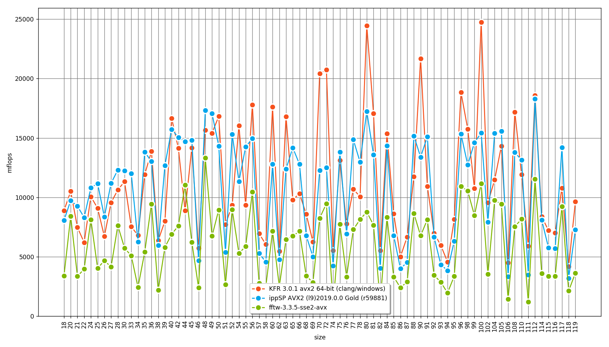
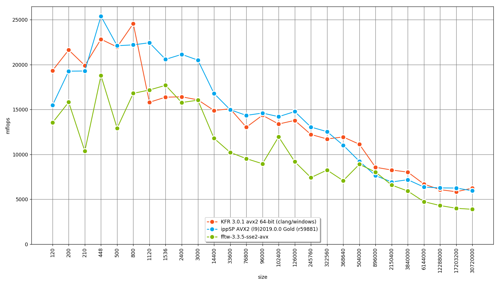
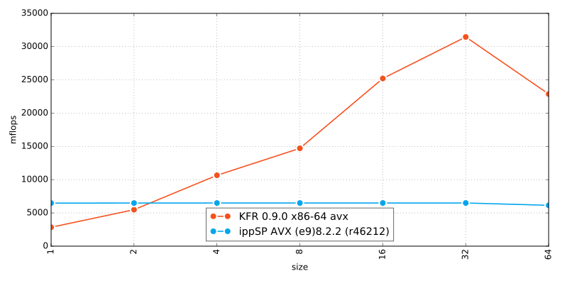

# KFR - Fast, modern C++ DSP framework

  

https://www.kfrlib.com

KFR is an open source C++ DSP framework that contains high performance building blocks for DSP, audio, scientific and other applications. It is distributed under GPLv2+ and a [commercial license](https://kfrlib.com/purchase).

:star2: **New**: Explore benchmark results from the LIGO, Virgo, and KAGRA collaborations, comparing KFR performance against FFTW for signal processing in gravitational-wave research: https://ar5iv.labs.arxiv.org/html/2503.14292

## KFR 7 - What's New

* KFR 7.1 additions:
  * `ngfft`: low-overhead FFT API with manual memory management
  * Up to 40% faster power-of-two FFTs and faster FFTs for sizes with many prime factors
  * DFT support for GCC and MSVC
  * `audio_filter` for independent multi-channel FIR, IIR, and convolution filtering of planar `audio_data`
  * Core Audio decoding on macOS and iOS
  * Bit-index permutation optimizations for Clang and the generic backend
* Elliptic filter design
* Zero-Phase IIR Filter (`filtfilt`)
* Audio encoding/decoding: WAV, W64, RF64/BW64, AIFF, FLAC, CAF, ALAC, MP3 (decoding only), raw PCM, and AAC/other Media Foundation formats (Windows) or Core Audio formats (Apple platforms)
* Universal macOS Binaries (Intel + Apple Silicon)
* Basic RISC-V support
    * Only CPUs with VLEN >= 128 are supported
    * Linux only, clang required
* C++20
* New optimized functions
* Performance improvements
* Broader GCC support
* Tests are migrated to Catch2 framework
* Progress since KFR 6:
    * Multidimensional DFT via the C API
    * DFT performance improved by up to 80% on ARM and ARM64
    * New Android x86/x64 and Linux ARM/AArch64 builds
    * Matrix transpose up to 30% faster
* [More](docs/docs/getting-started/whatsnew7.md)

## Our other projects

[**🟣 Brisk**](https://github.com/brisklib/brisk) is a cross-platform C++20 GUI framework featuring MVVM architecture, reactive capabilities, and scalable, accelerated GPU rendering. *(GPL/Commercial)*

[**🟢 CxxDox**](https://github.com/kfrlib/cxxdox) — C++ documentation generator. *(Apache-2.0)*

## KFR Installation

Compiler support:

KFR has no external C++ dependencies beyond a C++20-compatible standard library. CMake is used as the build system.

Since KFR 7.1, KFR provides the same level of support for Clang, GCC, and MSVC.
MSVC builds may provide lower performance, especially for DFT and other complex
algorithms; use Clang or GCC when maximum performance is required.

Clang can be used to build Visual Studio projects, either for selected targets or as the primary compiler, while maintaining full compatibility with code built by Visual Studio.

ARM, ARM64, and RISC-V targets require Clang or GCC.

| Platform | ABI / compiler   | Compiler command | Support             | Performance         |
|----------|------------------|------------------|---------------------|---------------------|
| Linux    | GCC              | `g++`            | ✅ Supported         | ✅ Full performance  |
| Linux    | Clang            | `clang++`        | ✅ Supported         | ✅ Full performance  |
| macOS    | Clang            | `clang++`        | ✅ Supported         | ✅ Full performance  |
| Android  | Clang            | `clang++`        | ✅ Supported         | ✅ Full performance  |
| iOS      | Clang            | `clang++`        | ✅ Supported         | ✅ Full performance  |
| Windows  | MSVC ABI / MSVC  | `cl.exe`         | ✅ Supported on x86* | ⚠️ May be lower, especially for DFT and complex algorithms |
| Windows  | MSVC ABI / Clang | `clang-cl.exe`   | ✅ Supported         | ✅ Full performance  |
| Windows  | MinGW / GCC      | `g++.exe`        | ✅ Supported         | ✅ Full performance  |
| Windows  | MinGW / Clang    | `clang++.exe`    | ✅ Supported         | ✅ Full performance  |
| WebAssembly | Emscripten    | `em++`           | ✅ Supported         | ✅ Full performance  |

\* MSVC support is limited to x86 and x86-64 targets.

Other operating systems, compilers, and CPUs may work but are outside the regular test matrix.

:arrow_right: See [Installation](docs/docs/getting-started/installation.md) docs for more details

## Features

### FFT/DFT
* Optimized DFT implementation for any size (non-power of two sizes are supported)
* DFT performance is on par with the most performant implementation currently available [See Benchmarks](#benchmark-results)
* Real forward and inverse DFT
* Multidimensional complex and real DFT
* Discrete Cosine Transform type II (and its inverse, also called DCT type III)
* Convolution using FFT
* Convolution filter

:arrow_right: See also [How to apply FFT](docs/docs/dft/dft.md) with KFR

### DSP

* IIR filter design
  * Elliptic
  * Butterworth
  * Chebyshev type I and II
  * Bessel
  * Lowpass, highpass, bandpass and bandstop filters
  * Conversion of arbitrary filter from {Z, P, K} to SOS format (suitable for biquad function and filter)
* Zero-Phase IIR Filtering
* Biquad filter [See Benchmarks](#benchmark-results)
* Simple biquad filter design
* FIR filter design using window method
* Loudness measurement according to EBU R128
* Window functions: Triangular, Bartlett, Cosine, Hann, Bartlett-Hann, Hamming, Bohman, Blackman, Blackman-Harris, Kaiser, Flattop, Gaussian, Lanczos, Rectangular
* Sample rate conversion with configurable quality and linear phase
* Oscillators, fast incremental sine/cosine generation,  Goertzel algorithm, fractional delay

### Base

* Tensors (multidimensional arrays)
* .npy support (reading/writing)
* Matrix transpose
* Statistical functions
* Random number generation
* Template expressions (See examples)
* Ring (Circular) buffer
* Windows arm64 support
* RISC-V support
* Emscripten (wasm/wasm64) support
* Scoped control over denormal flushing for stable floating-point behavior
* Interleaved and planar data support with sample type conversion

### Math

* Mathematical functions such as `sin`, `log` and `cosh` built on top of SIMD primitives
* Most of the standard library functions are re-implemented to support vector of any length and data type

### SIMD

* `vec<T, N>` class and related functions that abstracts cpu-specific intrinsics
* All code in the library is optimized for Intel, AMD (SSE2, SSE3, SSE4.x, AVX and AVX2 and AVX512) and ARM, AArch64 (NEON) processors
* All data types are supported including complex numbers
* All vector lengths are also supported. `vec<float,1>`, `vec<unsigned,3>`, `vec<complex<float>, 11>` all are valid vector types in KFR
* Sorting

### IO

* Audio file reading/writing
    * Wave (WAV)
    * W64
    * RF64/BW64
    * AIFF
    * FLAC
    * Apple CAF
    * ALAC
    * MP3 (decoding only)
    * Raw PCM
    * decoding AAC and other formats using Media Foundation (Windows) or Core Audio (Apple platforms)

### Multiarchitecture

The multiarchitecture mode enables building algorithms for multiple architectures with runtime dispatch to detect the CPU of the target machine and select the best code path

* Multiarchitecture for DFT, resampling, FIR and IIR filters.
* Runtime dispatch is available on x86; it is disabled on non-x86, Android, and Emscripten builds.

### C API

C API is available and includes a subset of KFR features including FFT and filter processing.

* Support for non x86 systems.

## Benchmark results

### DFT

Powers of 2, from 16 to 16777216 (*Higher is better*)

Prime numbers from 17 to 127 (*Higher is better*)

Small numbers from 18 to 119 (*Higher is better*)

Random sizes from 120 to 30720000 (*Higher is better*)

See [fft benchmark](https://github.com/kfrlib/fft-benchmark) for details about benchmarking process.

### Biquad

(*Higher is better*)

## Documentation

KFR 7 (latest)
https://www.kfrlib.com/docs/latest/

KFR 6
https://www.kfrlib.com/docs/v6/

Built with
* [cxxdox - generates markdown docs from C++](https://github.com/kfrlib/cxxdox)
* [mkdocs - static documentation generator](https://www.mkdocs.org/)
* [mkdocs-material - material theme for mkdocs](https://squidfunk.github.io/mkdocs-material/)

## Branches

`dev` - current development version. Pull requests should go to `dev`.

`main` - current stable version passing all compiler/architecture tests.

`v6` - previous version of KFR (no new features, fixes only)

## License

KFR is dual-licensed, available under both commercial and open-source GPLv2+ license.

If you want to use KFR in a commercial product or a closed-source project, you need to [purchase a Commercial License](https://kfrlib.com/purchase-license).
