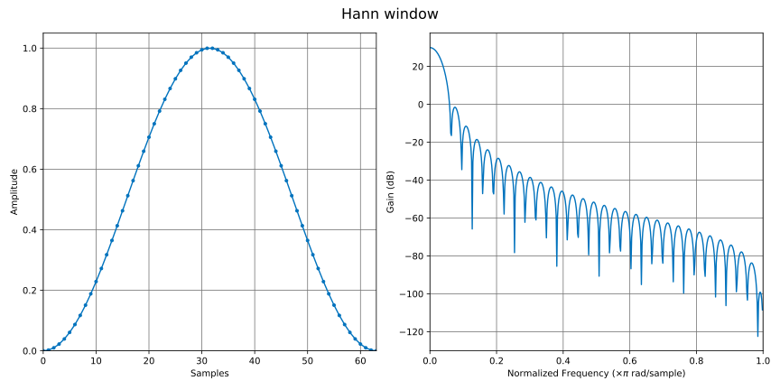

# Plotting DSP data

KFR can generate plots for a [[`univector<T, Size>`:nosig]] or another sized numeric container. The plotting functions write a Python script and run it with `python`, falling back to `python3` when necessary. The script uses the repository's `dspplot` package to draw the figure. This is a convenient development and documentation tool, not a real-time plotting API.

Include `<kfr/io.hpp>` (or `<kfr/all.hpp>`) to use the plotting functions.

## Prerequisites

Install Python and ensure that either `python` or `python3` is available on `PATH`. The renderer requires NumPy, SciPy, and Matplotlib. From the repository root, install the project requirements with:

```shell
python3 -m pip install -r requirements.txt
```

Alternatively, install just the plotting dependencies:

```shell
python3 -m pip install numpy scipy matplotlib
```

The generated Python script locates KFR's in-tree `dspplot` module relative to the script. When using an installed copy of KFR rather than a source checkout, make that module available to Python separately, for example by installing the `dspplot` package from the repository's `dspplot` directory.

## Plotting numeric data

[[`plot_show(const std::string &, const T &, const std::string &)`:nosig]] opens a plot window. [[`plot_save(const std::string &, const T &, const std::string &)`:nosig]] saves an SVG instead. Both functions copy the input samples into a generated Python list, so use a reasonably sized numeric container such as [[`univector<T, Size>`:nosig]]. Non-finite floating-point values are written as zero.

For numeric data, the default figure has a sample-domain plot and an FFT-derived magnitude response. The magnitude plot uses the first half of an FFT whose size is at least the input length and `padwidth` (1024 by default). It is displayed in dB with a floor of $-300\ \mathrm{dB}$. The default frequency axis is 10 Hz to $Fs/2$, where `Fs` defaults to 48000 Hz.

```c++
|||#include <kfr/io.hpp>
|||#include <kfr/dsp.hpp>

|||using namespace kfr;
|||TEST_CASE("audio_io/plot.md/numeric data")
|||
|||{

univector<float> data = { 0.0f, 1.0f, 0.5f, 0.0f, -0.5f };

||||||||||||
plot_show("signal", data,
          "title='Signal', Fs=48000, log_freq=True, padwidth=8192");
||||||||||||
|||CHECK(data.size() == 5);
|||}
```

The third argument is inserted directly as Python keyword arguments. It is therefore Python syntax, not a C++ options object. Use single quotes inside the C++ string for a title, as in the example.

### Example: plotting a window

This Hann-window example shows the samples as points and its normalized-frequency magnitude response. It uses the same output generated for the [Window functions examples](../dsp/examples/window_gallery.md).

```c++ linenums="1"
|||TEST_CASE("audio_io/plot.md/window")
|||{
const std::string options = "freqresp=True, dots=True, padwidth=1024, "
                            "log_freq=False, horizontal=False, normalized_freq=True";
univector<fbase, 64> output;

output = window_hann(output.size());
||||||||||||
plot_save("window_hann", output, options + ", title='Hann window'");
||||||||||||
|||CHECK(output.size() == 64);
|||}
```



### Saving a plot

```c++
|||TEST_CASE("audio_io/plot.md/save numeric data")
|||{
univector<float> data = { 0.0f, 1.0f, 0.5f, 0.0f, -0.5f };
||||||||||||
plot_save("signal", data,
          "title='Signal', Fs=48000, log_freq=True, padwidth=8192");
||||||||||||
|||CHECK(data.size() == 5);
|||}
```

`plot_save` writes `signal.py` to the process's current working directory and asks the renderer to save the image as `../svg/signal.svg` relative to that directory. Create the destination directory before running the program. Do not pass `file=...` in the options string: `plot_save` supplies the output path itself.

## Plotting filter responses

Pass filter coefficients or an impulse response as numeric data. For an FIR filter with centred, odd-length coefficients, `phasearg='auto'` removes the linear phase due to the coefficient centre. For a response delayed by a known number of samples, pass that delay as a numeric `phasearg` instead.

```c++
|||TEST_CASE("audio_io/plot.md/filter response")
|||{
const auto sections = iir_params{ biquad_lowpass<float>(1000.0f / 48000.0f, 0.707f) };
univector<float, 1024> response = iir(unitimpulse(), sections);

||||||||||||
plot_save("lowpass_response", response,
          "title='Low-pass response', Fs=48000, phaseresp=True, "
          "log_freq=True, freq_dB_lim=(-160, 10), padwidth=8192");
||||||||||||
|||CHECK(response.size() == 1024);
|||}
```

Set `Fs` whenever the response was designed for a specific sample rate so that the frequency scale is correct. `log_freq=True` selects a logarithmic frequency axis; `normalized_freq=True` instead displays a $0$ to $1$ axis in units of $\times\pi$ rad/sample. `freq_dB_lim=(low, high)` fixes the magnitude range. Set `div_by_N=True` to divide FFT bins by the sample count before converting to dB, which is useful when comparing spectra of signals with different lengths.

The most useful plotting options are:

| Option                   | Effect                                                                     |
|--------------------------|----------------------------------------------------------------------------|
| `title='...'`            | Sets the figure title.                                                     |
| `Fs=48000`               | Sets the sample rate used by the Hz frequency axis.                        |
| `padwidth=8192`          | Sets the minimum FFT length; a larger value gives a denser frequency grid. |
| `freqresp=False`         | Hides the magnitude-response subplot.                                      |
| `phaseresp=True`         | Adds a phase-response subplot.                                             |
| `log_freq=True`          | Uses a logarithmic frequency axis.                                         |
| `normalized_freq=True`   | Uses normalized frequency instead of Hz.                                   |
| `freq_dB_lim=(-160, 10)` | Sets the visible dB range.                                                 |
| `phasearg='auto'`        | Compensates the centre delay of odd-length FIR coefficients.               |
| `dots=True`              | Marks individual sample points.                                            |

## Plotting WAV files

Passing a `std::string` or `const char*` file name to [[`plot_show(const std::string &, const std::string &, const std::string &)`:nosig]] selects the WAV/spectrogram path rather than the numeric-data path:

```c++
||||||||||||
plot_save("recording", "recording.wav",
          "title='Recording', segmentsize=1024, overlap=8");
||||||||||||
```

This path is intended for WAV files and produces a spectrogram. It is separate from KFR's general audio decoder support; see [Reading and Writing Audio Files](read_audio.md) to load, process, or save other supported audio formats. For numeric data, `spectrogram=True` also routes the renderer to this spectrogram view. `segmentsize`, `overlap`, `vmin`, `vmax`, and `normalize` set its analysis and display parameters.

## Troubleshooting

- If no window appears or no SVG is written, first run the generated `.py` script from the current working directory to see Python's error output.
- Confirm that `python` or `python3` selects the interpreter where the required packages were installed. KFR tries `python` first.
- Python plotting is unavailable on mobile and WebAssembly targets. The plotting functions report failures to standard error and return without rendering a plot.
- The name argument becomes the generated script file name and, for `plot_save`, part of the SVG path. Use a simple file-name-safe value.

## See also

- [FIR filters](../dsp/fir.md)
- [IIR filters](../dsp/iir.md)
- [Reading and Writing Audio Files](read_audio.md)
