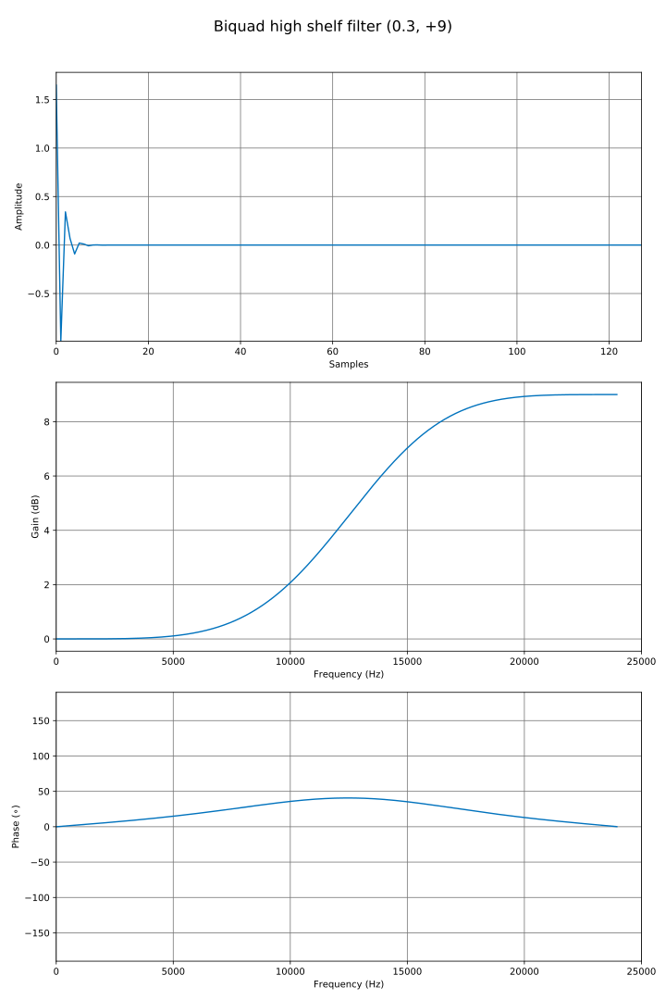
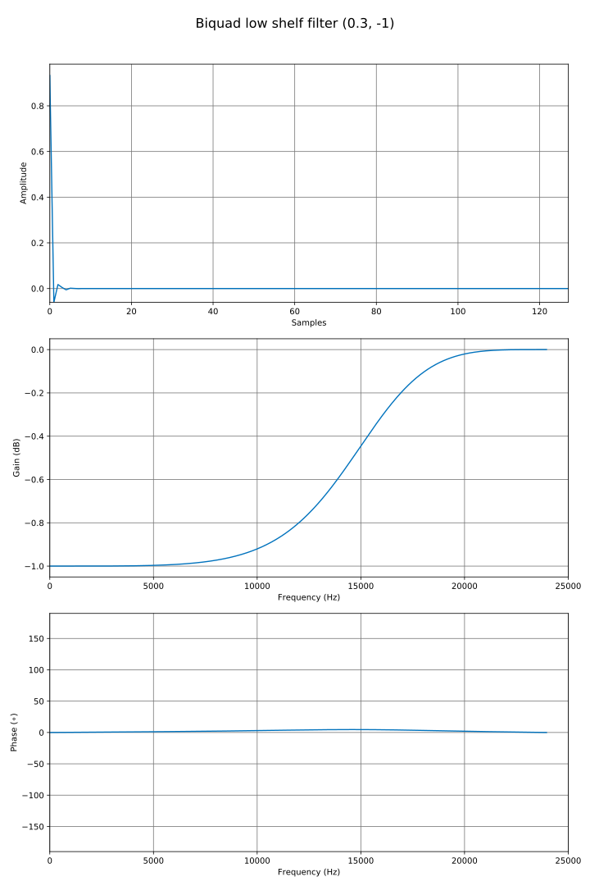
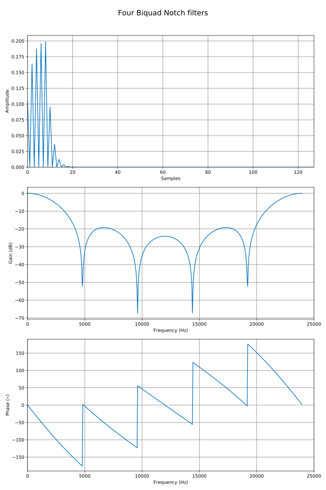
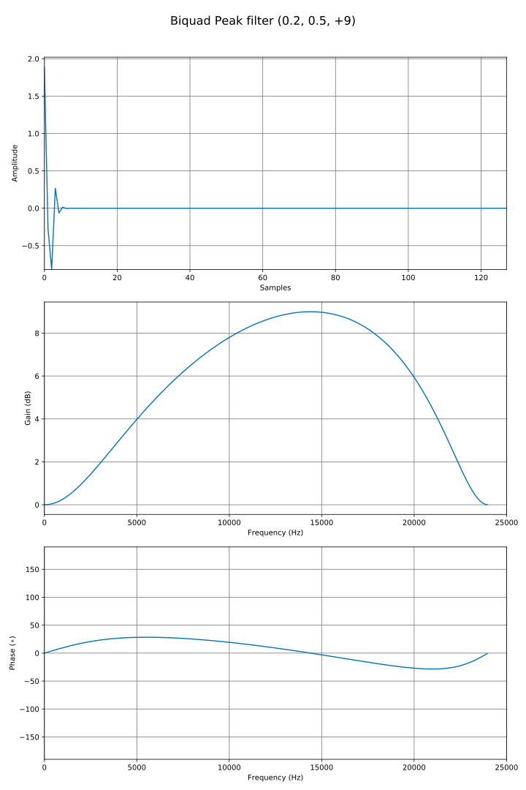
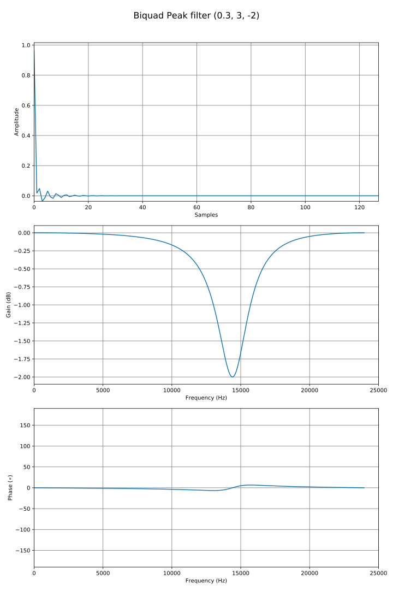
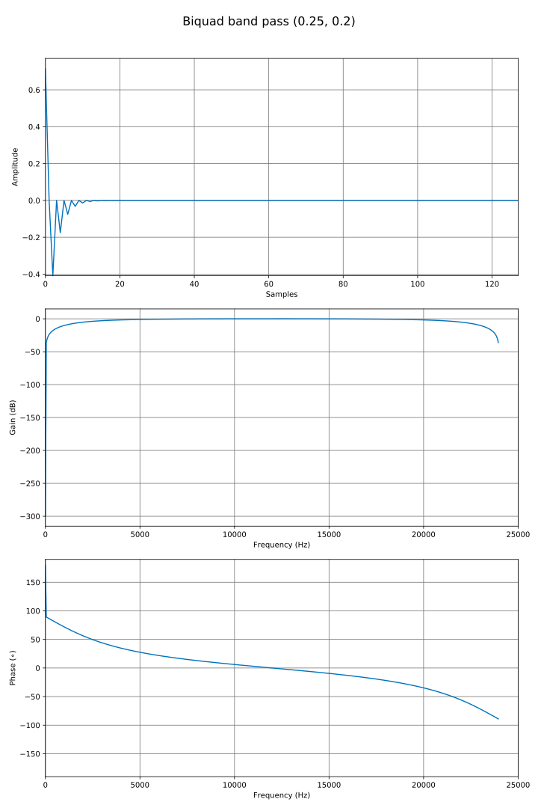
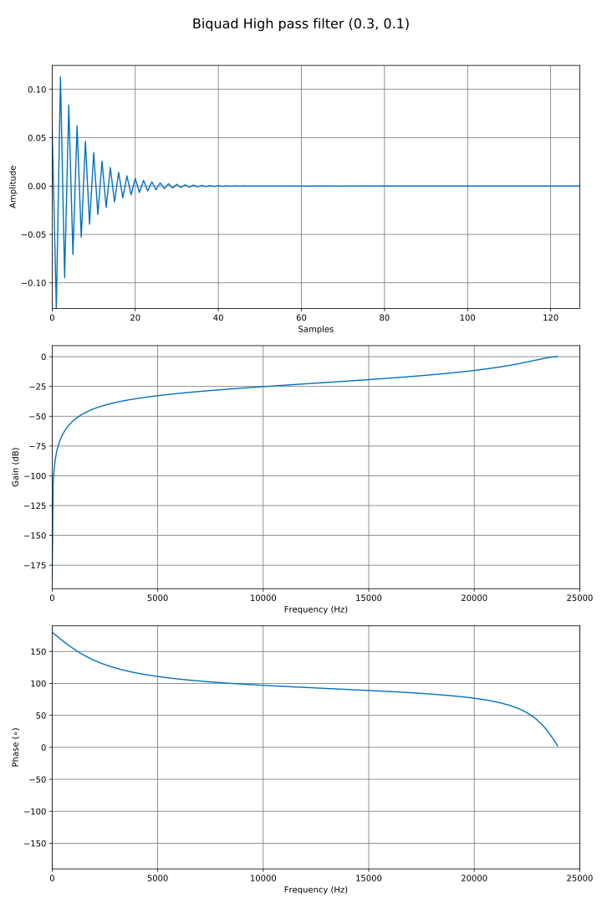

# Biquad filters code & examples

## Biquad high shelf filter (0.3, +9dB)

Code
```c++ linenums="1"
const std::string options = "phaseresp=True";
univector<fbase, 128> output;

biquad_params<fbase> bq[] = { biquad_highshelf(0.3, +9.0) };
output                    = biquad(bq, unitimpulse());
plot_save("biquad_highshelf", output, options + ", title='Biquad high shelf filter (0.3, +9)'");
```
Result



## Biquad Low pass filter (0.2, 0.9)

Code
```c++ linenums="1"
const std::string options = "phaseresp=True";
univector<fbase, 128> output;

biquad_params<fbase> bq[] = { biquad_lowpass(0.2, 0.9) };
output                    = biquad(bq, unitimpulse());
plot_save("biquad_lowpass", output, options + ", title='Biquad Low pass filter (0.2, 0.9)'");
```
Result


## Biquad low shelf filter (0.3, -1dB)

Code
```c++ linenums="1"
const std::string options = "phaseresp=True";
univector<fbase, 128> output;

biquad_params<fbase> bq[] = { biquad_lowshelf(0.3, -1.0) };
output                    = biquad(bq, unitimpulse());
plot_save("biquad_lowshelf", output, options + ", title='Biquad low shelf filter (0.3, -1)'");
```
Result



## Four Biquad Notch filters

Code
```c++ linenums="1"
const std::string options = "phaseresp=True";
univector<fbase, 128> output;

biquad_params<fbase> bq[] = { biquad_notch(0.1, 0.5), biquad_notch(0.2, 0.5), biquad_notch(0.3, 0.5),
                                biquad_notch(0.4, 0.5) };
output                    = biquad(bq, unitimpulse());
plot_save("biquad_notch", output, options + ", title='Four Biquad Notch filters'");
```
Result



## Biquad Peak filter (0.2, 0.5, +9dB)

Code
```c++ linenums="1"
const std::string options = "phaseresp=True";
univector<fbase, 128> output;
biquad_params<fbase> bq[] = { biquad_peak(0.3, 0.5, +9.0) };
output                    = biquad(bq, unitimpulse());
plot_save("biquad_peak", output, options + ", title='Biquad Peak filter (0.2, 0.5, +9)'");
```
Result



## Biquad Peak filter (0.3, 3, -2dB)

Code
```c++ linenums="1"
const std::string options = "phaseresp=True";
univector<fbase, 128> output;

biquad_params<fbase> bq[] = { biquad_peak(0.3, 3.0, -2.0) };
output                    = biquad(bq, unitimpulse());
plot_save("biquad_peak2", output, options + ", title='Biquad Peak filter (0.3, 3, -2)'");
```
Result



## Biquad Peak filter (0.3, 3, -2dB)

Code
```c++ linenums="1"
const std::string options = "phaseresp=True";
univector<fbase, 128> output;

biquad_params<fbase> bq[] = { biquad_bandpass(0.25, 0.2) };
output                    = biquad(bq, unitimpulse());
plot_save("biquad_bandpass", output, options + ", title='Biquad band pass (0.25, 0.2)'");
```
Result



## Biquad High pass filter (0.3, 0.1)

Code
```c++ linenums="1"
const std::string options = "phaseresp=True";
univector<fbase, 128> output;

biquad_params<fbase> bq[] = { biquad_highpass(0.3, 0.1) };
output                    = biquad(bq, unitimpulse());
plot_save("biquad_highpass", output, options + ", title='Biquad High pass filter (0.3, 0.1)'");
```
Result



