# Window functions code & examples

## Table of Contents

* [Hann window](#hann-window)
* [Hamming window](#hamming-window)
* [Blackman window](#blackman-window)
* [Blackman-Harris window](#blackman-harris-window)
* [Gaussian window](#gaussian-window)
* [Triangular window](#triangular-window)
* [Bartlett window](#bartlett-window)
* [Cosine window](#cosine-window)
* [Cosine window (numpy compatible)](#cosine-window-numpy-compatible)
* [Bartlett-Hann window](#bartlett-hann-window)
* [Bohman window](#bohman-window)
* [Lanczos window](#lanczos-window)
* [Flat top window](#flat-top-window)
* [Kaiser window](#kaiser-window)

## Hann window

Code
```c++ linenums="1"
|||#include <kfr/dsp.hpp>
|||using namespace kfr;
|||
|||TEST_CASE("dsp/examples/window_gallery.md/Hann")
|||{
const std::string options = "freqresp=True, dots=True, padwidth=1024, "
                            "log_freq=False, horizontal=False, normalized_freq=True";
univector<fbase, 64> output;

output = window_hann(output.size());
|||CHECK(output[32] > output[0]);
||||||||||
plot_save("window_hann", output, options + ", title='Hann window'");
||||||||||
|||}
```
Result


## Hamming window

Code
```c++ linenums="1"
|||TEST_CASE("dsp/examples/window_gallery.md/Hamming")
|||{
const std::string options = "freqresp=True, dots=True, padwidth=1024, "
                            "log_freq=False, horizontal=False, normalized_freq=True";
univector<fbase, 64> output;

output = window_hamming(output.size());
|||CHECK(output[32] > output[0]);
||||||||||
plot_save("window_hamming", output, options + ", title='Hamming window'");
||||||||||
|||}
```
Result
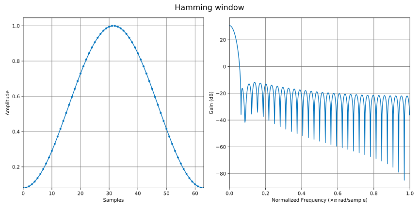

## Blackman window

Code
```c++ linenums="1"
|||TEST_CASE("dsp/examples/window_gallery.md/Blackman")
|||{
const std::string options = "freqresp=True, dots=True, padwidth=1024, "
                            "log_freq=False, horizontal=False, normalized_freq=True";
univector<fbase, 64> output;

output = window_blackman(output.size());
|||CHECK(output[32] > output[0]);
||||||||||
plot_save("window_blackman", output, options + ", title='Blackman window'");
||||||||||
|||}
```
Result
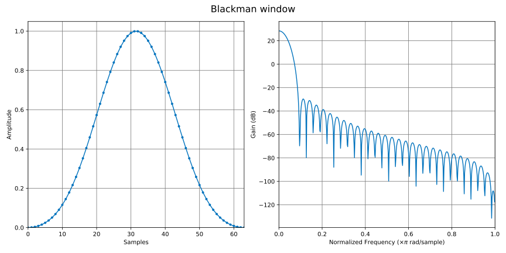

## Blackman-Harris window

Code
```c++ linenums="1"
|||TEST_CASE("dsp/examples/window_gallery.md/Blackman-Harris")
|||{
const std::string options = "freqresp=True, dots=True, padwidth=1024, "
                            "log_freq=False, horizontal=False, normalized_freq=True";
univector<fbase, 64> output;

output = window_blackman_harris(output.size());
|||CHECK(output[32] > output[0]);
||||||||||
plot_save("window_blackman_harris", output, options + ", title='Blackman-Harris window'");
||||||||||
|||}
```
Result
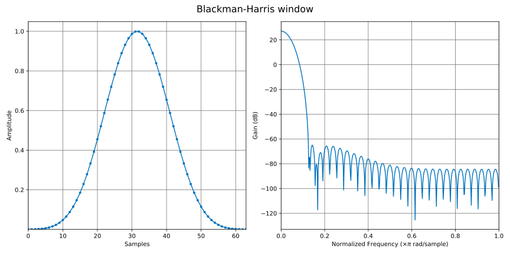

## Gaussian window

Code
```c++ linenums="1"
|||TEST_CASE("dsp/examples/window_gallery.md/Gaussian")
|||{
const std::string options = "freqresp=True, dots=True, padwidth=1024, "
                            "log_freq=False, horizontal=False, normalized_freq=True";
univector<fbase, 64> output;

output = window_gaussian(output.size());
|||CHECK(output[32] > output[0]);
||||||||||
plot_save("window_gaussian", output, options + ", title='Gaussian window'");
||||||||||
|||}
```
Result
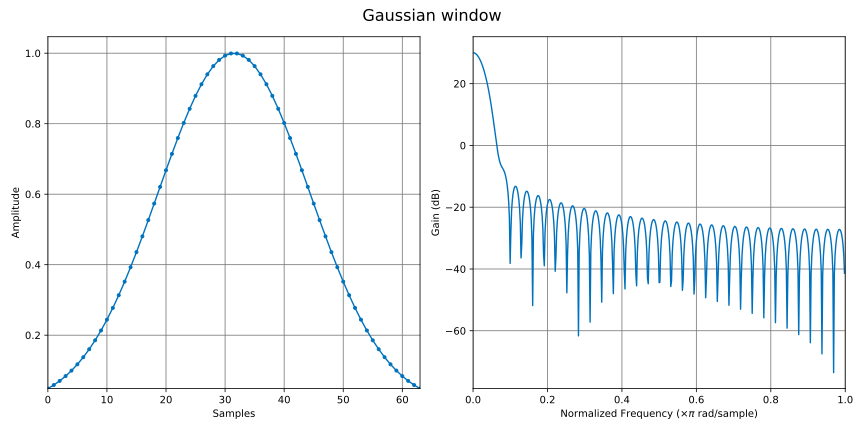

## Triangular window

Code
```c++ linenums="1"
|||TEST_CASE("dsp/examples/window_gallery.md/Triangular")
|||{
const std::string options = "freqresp=True, dots=True, padwidth=1024, "
                            "log_freq=False, horizontal=False, normalized_freq=True";
univector<fbase, 64> output;

output = window_triangular(output.size());
|||CHECK(output[32] > output[0]);
||||||||||
plot_save("window_triangular", output, options + ", title='Triangular window'");
||||||||||
|||}
```
Result
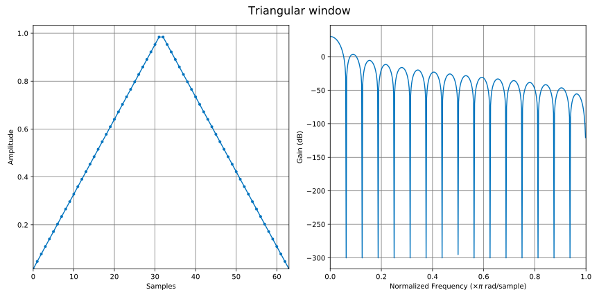

## Bartlett window

Code
```c++ linenums="1"
|||TEST_CASE("dsp/examples/window_gallery.md/Bartlett")
|||{
const std::string options = "freqresp=True, dots=True, padwidth=1024, "
                            "log_freq=False, horizontal=False, normalized_freq=True";
univector<fbase, 64> output;

output = window_bartlett(output.size());
|||CHECK(output[32] > output[0]);
||||||||||
plot_save("window_bartlett", output, options + ", title='Bartlett window'");
||||||||||
|||}
```
Result
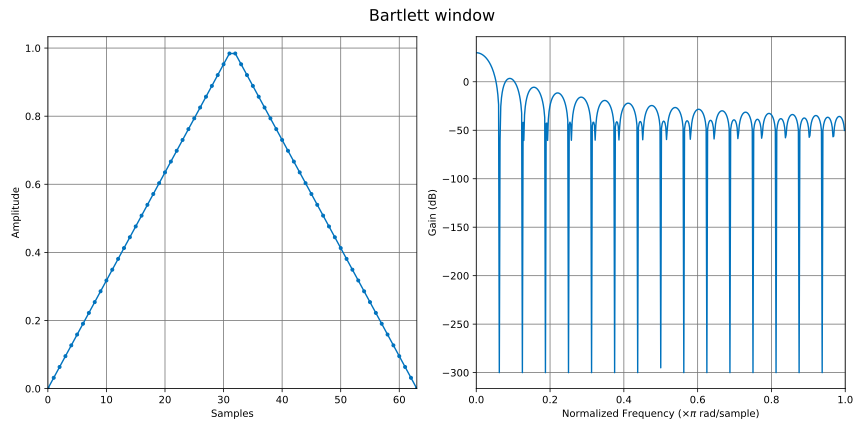

## Cosine window

Code
```c++ linenums="1"
|||TEST_CASE("dsp/examples/window_gallery.md/Cosine")
|||{
const std::string options = "freqresp=True, dots=True, padwidth=1024, "
                            "log_freq=False, horizontal=False, normalized_freq=True";
univector<fbase, 64> output;

output = window_cosine(output.size());
|||CHECK(output[32] > output[0]);
||||||||||
plot_save("window_cosine", output, options + ", title='Cosine window'");
||||||||||
|||}
```
Result
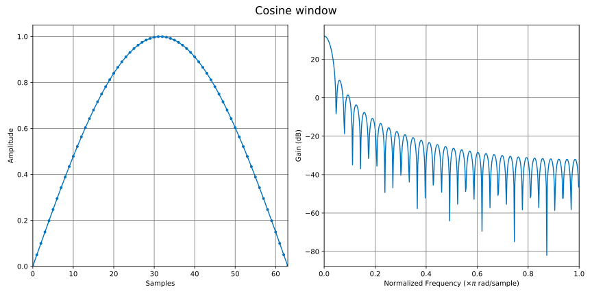

## Cosine window (numpy compatible)

Code
```c++ linenums="1"
|||TEST_CASE("dsp/examples/window_gallery.md/Cosine NumPy")
|||{
const std::string options = "freqresp=True, dots=True, padwidth=1024, "
                            "log_freq=False, horizontal=False, normalized_freq=True";
univector<fbase, 64> output;

output = window_cosine_np(output.size());
|||CHECK(output[32] > output[0]);
||||||||||
plot_save("window_cosine_np", output, options + ", title='Cosine window (numpy compatible)'");
||||||||||
|||}
```
Result
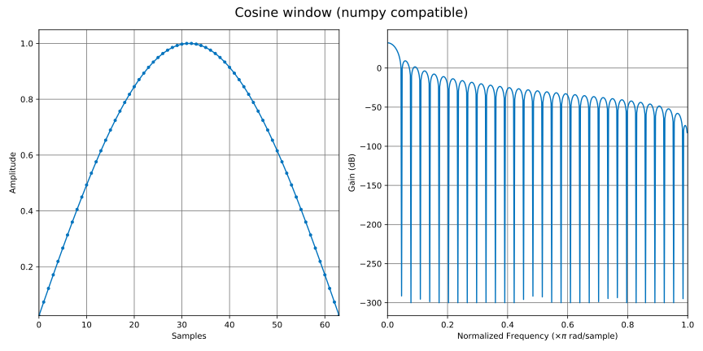

## Bartlett-Hann window

Code
```c++ linenums="1"
|||TEST_CASE("dsp/examples/window_gallery.md/Bartlett-Hann")
|||{
const std::string options = "freqresp=True, dots=True, padwidth=1024, "
                            "log_freq=False, horizontal=False, normalized_freq=True";
univector<fbase, 64> output;

output = window_bartlett_hann(output.size());
|||CHECK(output[32] > output[0]);
||||||||||
plot_save("window_bartlett_hann", output, options + ", title='Bartlett-Hann window'");
||||||||||
|||}
```
Result
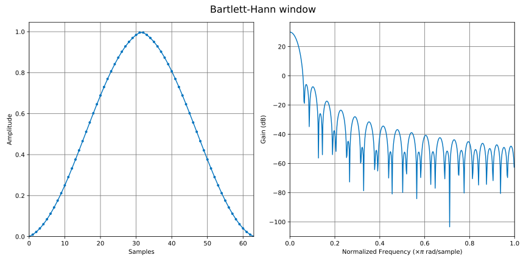

## Bohman window

Code
```c++ linenums="1"
|||TEST_CASE("dsp/examples/window_gallery.md/Bohman")
|||{
const std::string options = "freqresp=True, dots=True, padwidth=1024, "
                            "log_freq=False, horizontal=False, normalized_freq=True";
univector<fbase, 64> output;

output = window_bohman(output.size());
|||CHECK(output[32] > output[0]);
||||||||||
plot_save("window_bohman", output, options + ", title='Bohman window'");
||||||||||
|||}
```
Result
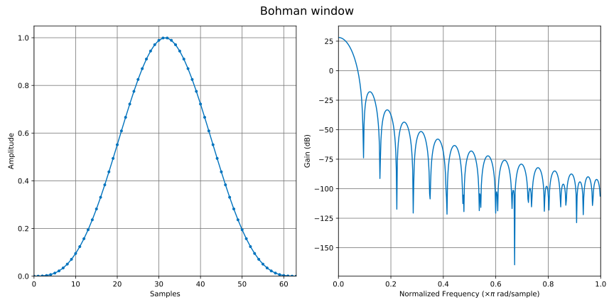

## Lanczos window

Code
```c++ linenums="1"
|||TEST_CASE("dsp/examples/window_gallery.md/Lanczos")
|||{
const std::string options = "freqresp=True, dots=True, padwidth=1024, "
                            "log_freq=False, horizontal=False, normalized_freq=True";
univector<fbase, 64> output;

output = window_lanczos(output.size());
|||CHECK(output[32] > output[0]);
||||||||||
plot_save("window_lanczos", output, options + ", title='Lanczos window'");
||||||||||
|||}
```
Result
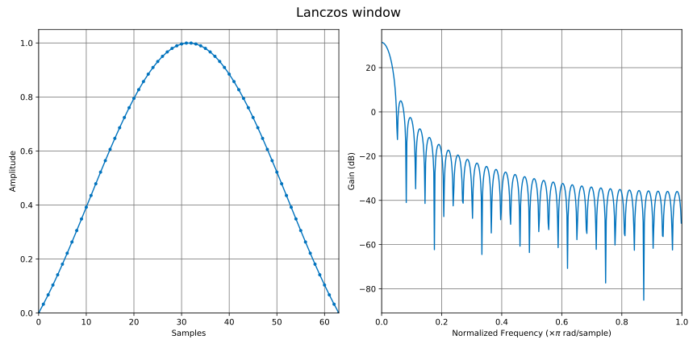

## Flat top window

Code
```c++ linenums="1"
|||TEST_CASE("dsp/examples/window_gallery.md/Flat top")
|||{
const std::string options = "freqresp=True, dots=True, padwidth=1024, "
                            "log_freq=False, horizontal=False, normalized_freq=True";
univector<fbase, 64> output;

output = window_flattop(output.size());
|||CHECK(output[32] > output[0]);
||||||||||
plot_save("window_flattop", output, options + ", title='Flat top window'");
||||||||||
|||}
```
Result
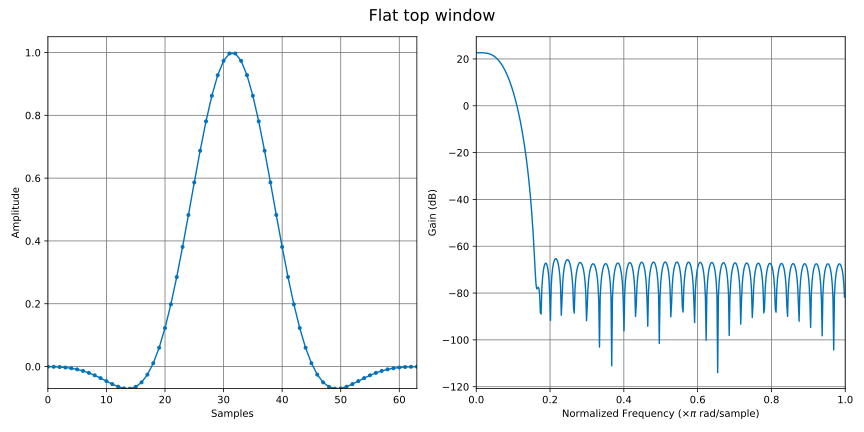

## Kaiser window

Code
```c++ linenums="1"
|||TEST_CASE("dsp/examples/window_gallery.md/Kaiser")
|||{
const std::string options = "freqresp=True, dots=True, padwidth=1024, "
                            "log_freq=False, horizontal=False, normalized_freq=True";
univector<fbase, 64> output;

output = window_kaiser(output.size(), 2.5);
|||CHECK(output[32] > output[0]);
||||||||||
plot_save("window_kaiser", output, options + ", title='Kaiser window'");
||||||||||
|||}
```
Result
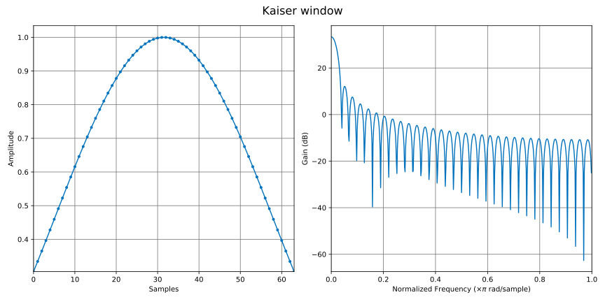
