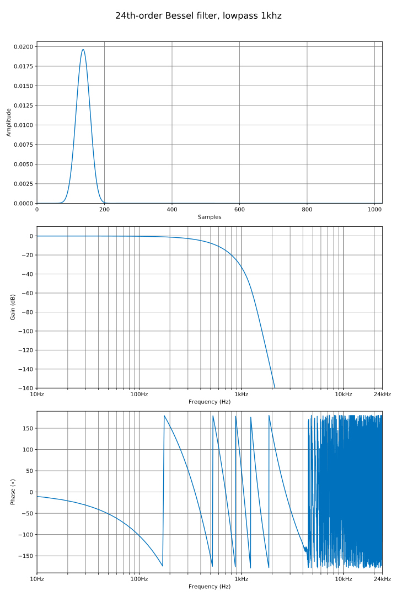
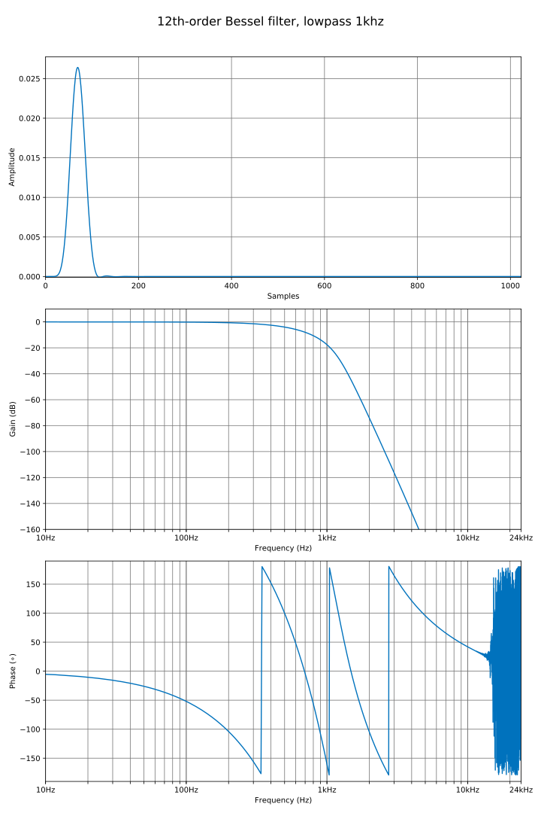
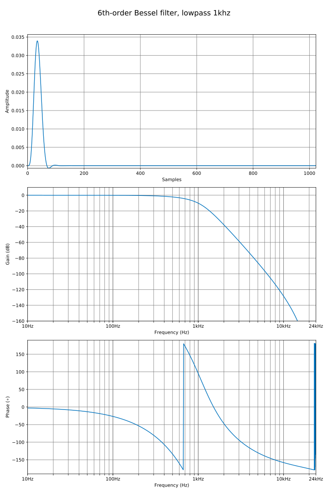
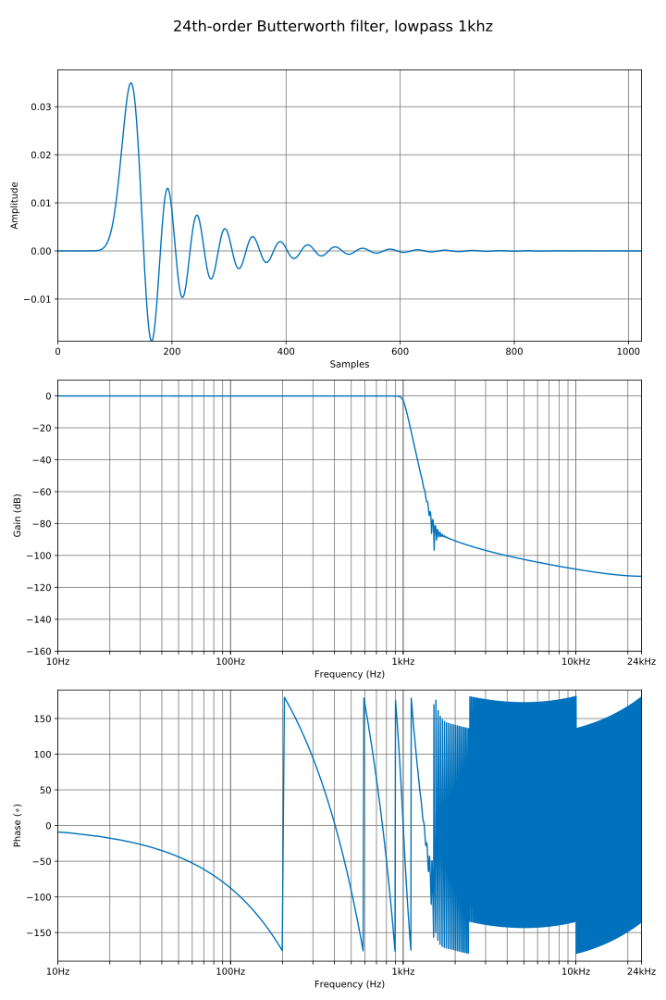
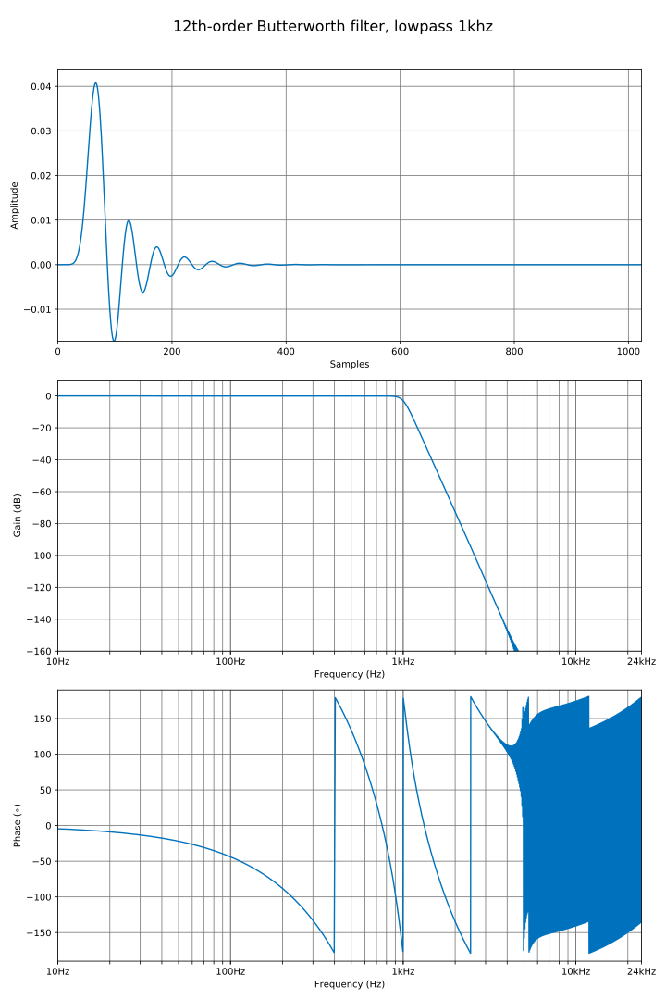
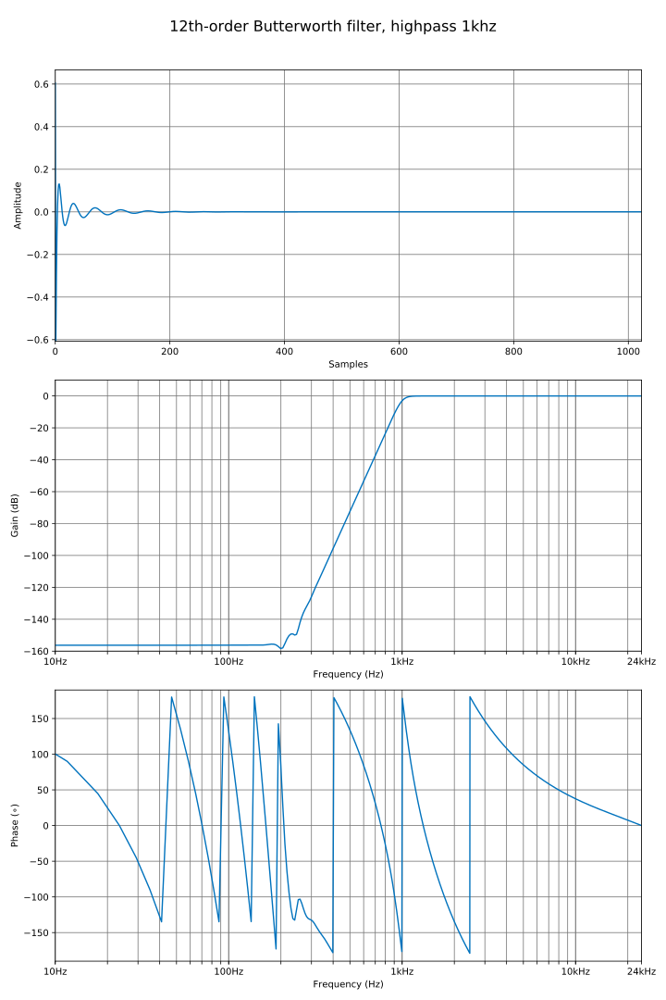
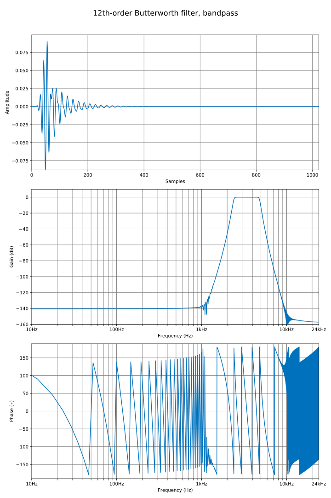
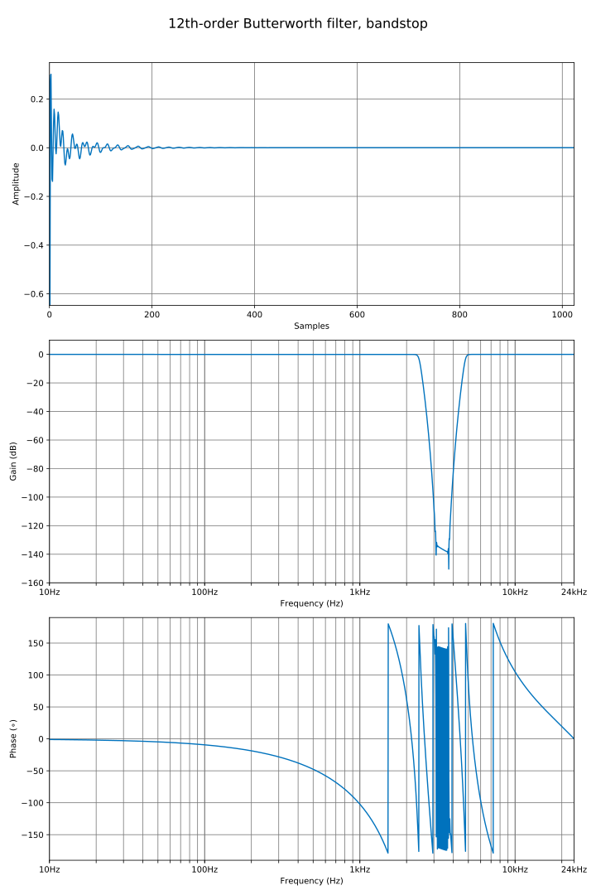
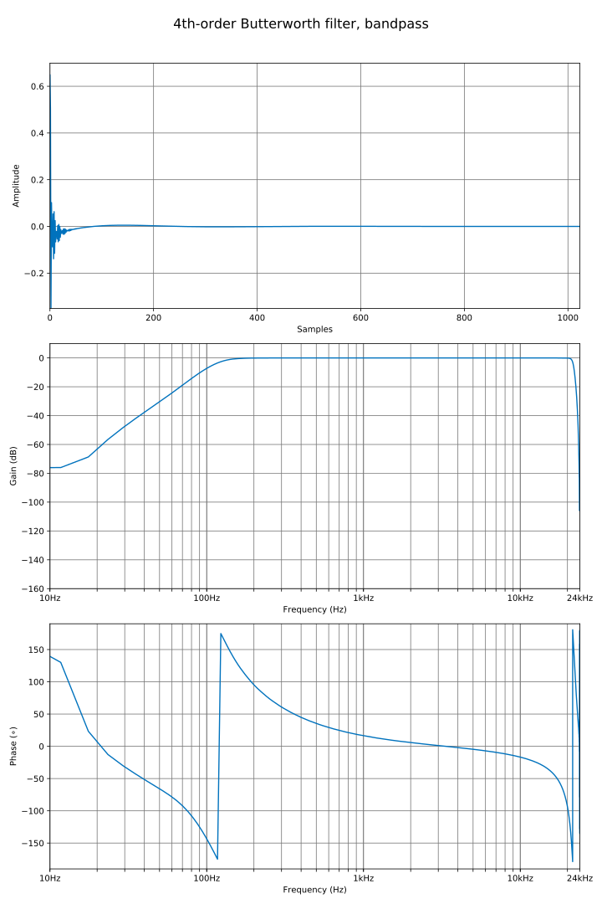
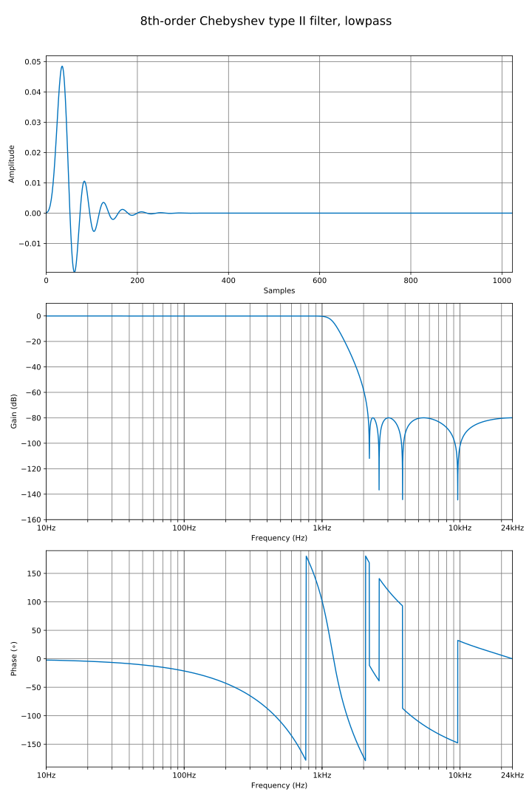

# IIR filters code & examples

## Table of Contents

* [24th-order Bessel filter, lowpass 1khz](#24th-order-bessel-filter-lowpass-1khz)
* [12th-order Bessel filter, lowpass 1khz](#12th-order-bessel-filter-lowpass-1khz)
* [6th-order Bessel filter, lowpass 1khz](#6th-order-bessel-filter-lowpass-1khz)
* [24th-order Butterworth filter, lowpass 1khz](#24th-order-butterworth-filter-lowpass-1khz)
* [12th-order Butterworth filter, lowpass 1khz](#12th-order-butterworth-filter-lowpass-1khz)
* [12th-order Butterworth filter, highpass 1khz](#12th-order-butterworth-filter-highpass-1khz)
* [12th-order Butterworth filter, bandpass](#12th-order-butterworth-filter-bandpass)
* [12th-order Butterworth filter, bandstop](#12th-order-butterworth-filter-bandstop)
* [4th-order Bessel filter, bandpass](#4th-order-bessel-filter-bandpass)
* [8th-order Chebyshev type I filter, lowpass](#8th-order-chebyshev-type-i-filter-lowpass)
* [8th-order Chebyshev type II filter, lowpass](#8th-order-chebyshev-type-ii-filter-lowpass)

## 24th-order Bessel filter, lowpass 1khz

Code
```c++ linenums="1"
const std::string options = "phaseresp=True, log_freq=True, freq_dB_lim=(-160, 10), padwidth=8192";
univector<fbase, 1024> output;

zpk<fbase> filt       = iir_lowpass(bessel<fbase>(24), 1000, 48000);
iir_params<fbase> bqs = to_sos(filt);
output                = iir(unitimpulse(), iir_params{ bqs });
plot_save("bessel_lowpass24", output, options + ", title='24th-order Bessel filter, lowpass 1khz'");

```
Result




## 12th-order Bessel filter, lowpass 1khz

Code
```c++ linenums="1"
const std::string options = "phaseresp=True, log_freq=True, freq_dB_lim=(-160, 10), padwidth=8192";
constexpr size_t maxorder = 32;
univector<fbase, 1024> output;

zpk<fbase> filt       = iir_lowpass(bessel<fbase>(12), 1000, 48000);
iir_params<fbase> bqs = to_sos(filt);
output                = iir(unitimpulse(), iir_params{ bqs });
plot_save("bessel_lowpass12", output, options + ", title='12th-order Bessel filter, lowpass 1khz'");

```
Result



## 6th-order Bessel filter, lowpass 1khz

Code
```c++ linenums="1"
const std::string options = "phaseresp=True, log_freq=True, freq_dB_lim=(-160, 10), padwidth=8192";
constexpr size_t maxorder = 32;
univector<fbase, 1024> output;

zpk<fbase> filt       = iir_lowpass(bessel<fbase>(6), 1000, 48000);
iir_params<fbase> bqs = to_sos(filt);
output                = iir(unitimpulse(), iir_params{ bqs });
plot_save("bessel_lowpass6", output, options + ", title='6th-order Bessel filter, lowpass 1khz'");
```
Result



## 24th-order Butterworth filter, lowpass 1khz

Code
```c++ linenums="1"
const std::string options = "phaseresp=True, log_freq=True, freq_dB_lim=(-160, 10), padwidth=8192";
constexpr size_t maxorder = 32;
univector<fbase, 1024> output;

zpk<fbase> filt       = iir_lowpass(butterworth<fbase>(24), 1000, 48000);
iir_params<fbase> bqs = to_sos(filt);
output                = iir(unitimpulse(), iir_params{ bqs });
plot_save("butterworth_lowpass24", output,
              options + ", title='24th-order Butterworth filter, lowpass 1khz'");
```
Result




## 12th-order Butterworth filter, lowpass 1khz

Code
```c++ linenums="1"
const std::string options = "phaseresp=True, log_freq=True, freq_dB_lim=(-160, 10), padwidth=8192";
constexpr size_t maxorder = 32;
univector<fbase, 1024> output;

zpk<fbase> filt       = iir_lowpass(butterworth<fbase>(12), 1000, 48000);
iir_params<fbase> bqs = to_sos(filt);
output                = iir(unitimpulse(), iir_params{ bqs });
plot_save("butterworth_lowpass12", output,
              options + ", title='12th-order Butterworth filter, lowpass 1khz'");
```
Result 



## 12th-order Butterworth filter, highpass 1khz

Code
```c++ linenums="1"
const std::string options = "phaseresp=True, log_freq=True, freq_dB_lim=(-160, 10), padwidth=8192";
constexpr size_t maxorder = 32;
univector<fbase, 1024> output;

zpk<fbase> filt       = iir_highpass(butterworth<fbase>(12), 1000, 48000);
iir_params<fbase> bqs = to_sos(filt);
output                = iir(unitimpulse(), iir_params{ bqs });
plot_save("butterworth_highpass12", output,
              options + ", title='12th-order Butterworth filter, highpass 1khz'");
```
Result



## 12th-order Butterworth filter, bandpass

Code
```c++ linenums="1"
const std::string options = "phaseresp=True, log_freq=True, freq_dB_lim=(-160, 10), padwidth=8192";
constexpr size_t maxorder = 32;
univector<fbase, 1024> output;

zpk<fbase> filt       = iir_bandpass(butterworth<fbase>(12), 0.1, 0.2);
iir_params<fbase> bqs = to_sos(filt);
output                = iir(unitimpulse(), iir_params{ bqs });
plot_save("butterworth_bandpass12", output,
              options + ", title='12th-order Butterworth filter, bandpass'");
```
Result



## 12th-order Butterworth filter, bandstop

Code
```c++ linenums="1"
const std::string options = "phaseresp=True, log_freq=True, freq_dB_lim=(-160, 10), padwidth=8192";
constexpr size_t maxorder = 32;
univector<fbase, 1024> output;

zpk<fbase> filt       = iir_bandstop(butterworth<fbase>(12), 0.1, 0.2);
iir_params<fbase> bqs = to_sos(filt);
output                = iir(unitimpulse(), iir_params{ bqs });
plot_save("butterworth_bandstop12", output,
              options + ", title='12th-order Butterworth filter, bandstop'");
```
Result



## 4th-order Butterworth filter, bandpass

Code
```c++ linenums="1"
const std::string options = "phaseresp=True, log_freq=True, freq_dB_lim=(-160, 10), padwidth=8192";
constexpr size_t maxorder = 32;
univector<fbase, 1024> output;

zpk<fbase> filt       = iir_bandpass(butterworth<fbase>(4), 0.005, 0.9);
iir_params<fbase> bqs = to_sos(filt);
output                = iir(unitimpulse(), iir_params{ bqs });
plot_save("butterworth_bandpass4", output, options + ", title='4th-order Butterworth filter, bandpass'");
```
Result



## 8th-order Chebyshev type I filter, lowpass

Code
```c++ linenums="1"
const std::string options = "phaseresp=True, log_freq=True, freq_dB_lim=(-160, 10), padwidth=8192";
constexpr size_t maxorder = 32;
univector<fbase, 1024> output;

zpk<fbase> filt       = iir_lowpass(chebyshev1<fbase>(8, 2), 0.09);
iir_params<fbase> bqs = to_sos(filt);
output                = iir(unitimpulse(), iir_params{ bqs });
plot_save("chebyshev1_lowpass8", output,
              options + ", title='8th-order Chebyshev type I filter, lowpass'");
```
Result


## 8th-order Chebyshev type II filter, lowpass

Code
```c++ linenums="1"
const std::string options = "phaseresp=True, log_freq=True, freq_dB_lim=(-160, 10), padwidth=8192";
constexpr size_t maxorder = 32;
univector<fbase, 1024> output;

zpk<fbase> filt       = iir_lowpass(chebyshev2<fbase>(8, 80), 0.09);
iir_params<fbase> bqs = to_sos(filt);
output                = iir(unitimpulse(), iir_params{ bqs });
plot_save("chebyshev2_lowpass8", output,
              options + ", title='8th-order Chebyshev type II filter, lowpass'");
```
Result


