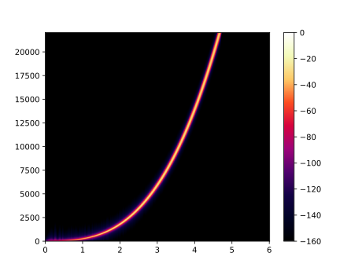
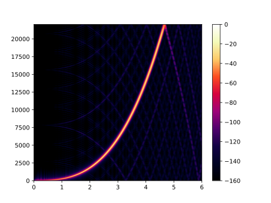
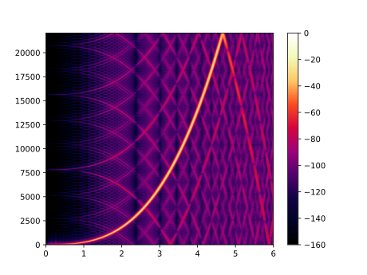

# Sample Rate Converter code & examples

### High quality preset

### High quality preset (taps=2048)

### Normal quality preset (taps=512)

### Low quality preset (taps=128)

### Draft quality preset (taps=32)
